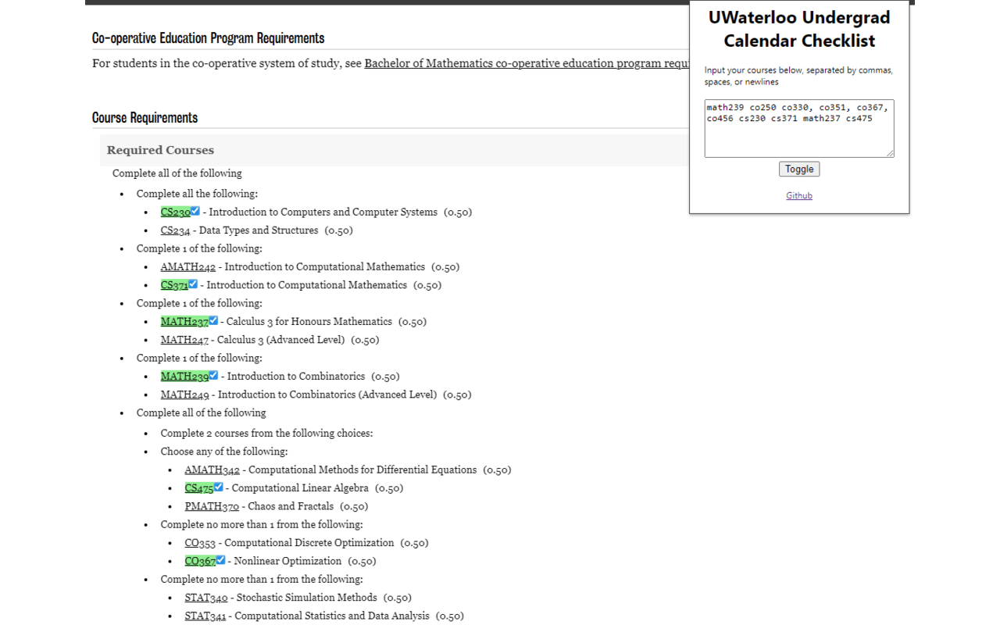
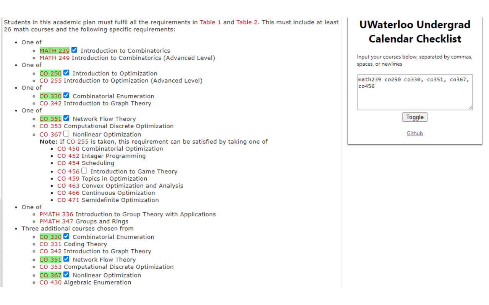

# UWaterloo Undergrad Calendar Checklist
This is a Chrome and Firefox extension designed to help undergraduate students at the University of Waterloo check if they satisfy their undergraduate program requirements by highlighting courses in the Undergraduate Calendar.
## Usage
Install this extension:
- Chrome (pending review)
- Firefox (pending review)

Navigate to the [Undergraduate Calendar](https://uwaterloo.ca/academic-calendar/undergraduate-studies/catalog#/programs) and select one of the programs.

Click on the extension icon, and click on the "Toggle" button to activate the extension.

Input courses into the text box, separated by commas, spaces, or newlines. For example, you can input `CS 135, CS 136, MATH 135` or `CS 135 CS 136 MATH 135`.

The extension will highlight the courses in the calendar, and add a checkbox next to the course code. The checkboxes are there to let you determine which course to keep highlighted in the event that there are multiple requirement listings for a course.

## Screenshots

